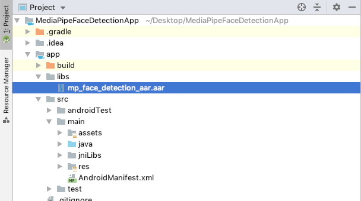
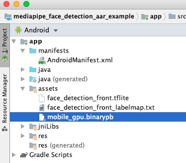
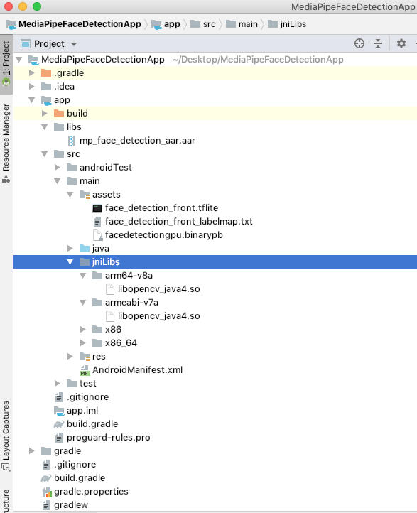

# MediaPipe Android Archive
{: .no_toc }

1. TOC
{:toc}
---

***Experimental Only***

The MediaPipe Android Archive (AAR) library is a convenient way to use MediaPipe
with Android Studio and Gradle. MediaPipe doesn't publish a general AAR that can
be used by all projects. Instead, developers need to add a mediapipe_aar()
target to generate a custom AAR file for their own projects. This is necessary
in order to include specific resources such as MediaPipe calculators needed for
each project.

## Steps to build a MediaPipe AAR

1.  Create a mediapipe_aar() target.

    In the MediaPipe directory, create a new mediapipe_aar() target in a BUILD
    file. You need to figure out what calculators are used in the graph and
    provide the calculator dependencies to the mediapipe_aar(). For example, to
    build an AAR for [MediaPipe Face Detection](../solutions/face_detection.md),
    you can put the following code into
    mediapipe/examples/android/src/java/com/google/mediapipe/apps/aar_example/BUILD.

    ```
    load("//mediapipe/java/com/google/mediapipe:mediapipe_aar.bzl", "mediapipe_aar")

    mediapipe_aar(
        name = "mp_face_detection_aar",
        calculators = ["//mediapipe/graphs/face_detection:mobile_calculators"],
    )
    ```

2.  Run the Bazel build command to generate the AAR.

    ```bash
    bazel build -c opt --host_crosstool_top=@bazel_tools//tools/cpp:toolchain --fat_apk_cpu=arm64-v8a,armeabi-v7a \
        //path/to/the/aar/build/file:aar_name
    ```

    For the face detection AAR target we made in the step 1, run:

    ```bash
    bazel build -c opt --host_crosstool_top=@bazel_tools//tools/cpp:toolchain --fat_apk_cpu=arm64-v8a,armeabi-v7a \
        //mediapipe/examples/android/src/java/com/google/mediapipe/apps/aar_example:mp_face_detection_aar

    # It should print:
    # Target //mediapipe/examples/android/src/java/com/google/mediapipe/apps/aar_example:mp_face_detection_aar up-to-date:
    # bazel-bin/mediapipe/examples/android/src/java/com/google/mediapipe/apps/aar_example/mp_face_detection_aar.aar
    ```

3.  (Optional) Save the AAR to your preferred location.

    ```bash
    cp bazel-bin/mediapipe/examples/android/src/java/com/google/mediapipe/apps/aar_example/mp_face_detection_aar.aar
    /absolute/path/to/your/preferred/location
    ```

## Steps to use a MediaPipe AAR in Android Studio with Gradle

1.  Start Android Studio and go to your project.

2.  Copy the AAR into app/libs.

    ```bash
    cp bazel-bin/mediapipe/examples/android/src/java/com/google/mediapipe/apps/aar_example/mp_face_detection_aar.aar
    /path/to/your/app/libs/
    ```

    

3.  Make app/src/main/assets and copy assets (graph, model, and etc) into
    app/src/main/assets.

    Build the MediaPipe binary graph and copy the assets into
    app/src/main/assets, e.g., for the face detection graph, you need to build
    and copy
    [the binary graph](https://github.com/google/mediapipe/blob/master/mediapipe/examples/android/src/java/com/google/mediapipe/apps/facedetectiongpu/BUILD#L41),
    [the tflite model](https://github.com/google/mediapipe/tree/master/mediapipe/models/face_detection_front.tflite),
    and
    [the label map](https://github.com/google/mediapipe/blob/master/mediapipe/models/face_detection_front_labelmap.txt).

    ```bash
    bazel build -c opt mediapipe/mediapipe/graphs/face_detection:mobile_gpu_binary_graph
    cp bazel-bin/mediapipe/graphs/face_detection/mobile_gpu.binarypb /path/to/your/app/src/main/assets/
    cp mediapipe/models/face_detection_front.tflite /path/to/your/app/src/main/assets/
    cp mediapipe/models/face_detection_front_labelmap.txt /path/to/your/app/src/main/assets/
    ```

    

4.  Make app/src/main/jniLibs and copy OpenCV JNI libraries into
    app/src/main/jniLibs.

    MediaPipe depends on OpenCV, you will need to copy the precompiled OpenCV so
    files into app/src/main/jniLibs. You can download the official OpenCV
    Android SDK from
    [here](https://github.com/opencv/opencv/releases/download/3.4.3/opencv-3.4.3-android-sdk.zip)
    and run:

    ```bash
    cp -R ~/Downloads/OpenCV-android-sdk/sdk/native/libs/arm* /path/to/your/app/src/main/jniLibs/
    ```

    

5.  Modify app/build.gradle to add MediaPipe dependencies and MediaPipe AAR.

    ```
    dependencies {
        implementation fileTree(dir: 'libs', include: ['*.jar', '*.aar'])
        implementation 'androidx.appcompat:appcompat:1.0.2'
        implementation 'androidx.constraintlayout:constraintlayout:1.1.3'
        testImplementation 'junit:junit:4.12'
        androidTestImplementation 'androidx.test.ext:junit:1.1.0'
        androidTestImplementation 'androidx.test.espresso:espresso-core:3.1.1'
        // MediaPipe deps
        implementation 'com.google.flogger:flogger:0.3.1'
        implementation 'com.google.flogger:flogger-system-backend:0.3.1'
        implementation 'com.google.code.findbugs:jsr305:3.0.2'
        implementation 'com.google.guava:guava:27.0.1-android'
        implementation 'com.google.guava:guava:27.0.1-android'
        implementation 'com.google.protobuf:protobuf-java:3.11.4'
        // CameraX core library
        def camerax_version = "1.0.0-beta10"
        implementation "androidx.camera:camera-core:$camerax_version"
        implementation "androidx.camera:camera-camera2:$camerax_version"
        implementation "androidx.camera:camera-lifecycle:$camerax_version"
    }
    ```

6.  Follow our Android app examples to use MediaPipe in Android Studio for your
    use case. If you are looking for an example, a face detection example can be
    found
    [here](https://github.com/jiuqiant/mediapipe_face_detection_aar_example) and
    a multi-hand tracking example can be found
    [here](https://github.com/jiuqiant/mediapipe_multi_hands_tracking_aar_example).
