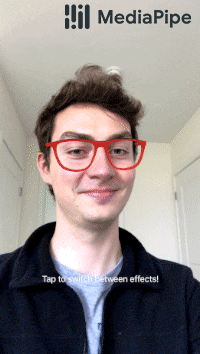

# MediaPipe Face Mesh
{: .no_toc }

1. TOC
{:toc}
---

## Overview

MediaPipe Face Mesh is a face geometry solution that estimates 468 3D face
landmarks in real-time even on mobile devices. It employs machine learning (ML)
to infer the 3D surface geometry, requiring only a single camera input without
the need for a dedicated depth sensor. Utilizing lightweight model architectures
together with GPU acceleration throughout the pipeline, the solution delivers
real-time performance critical for live experiences.

Additionally, the solution is bundled with the Face Geometry module that bridges
the gap between the face landmark estimation and useful real-time augmented
reality (AR) applications. It establishes a metric 3D space and uses the face
landmark screen positions to estimate face geometry within that space. The face
geometry data consists of common 3D geometry primitives, including a face pose
transformation matrix and a triangular face mesh. Under the hood, a lightweight
statistical analysis method called
[Procrustes Analysis](https://en.wikipedia.org/wiki/Procrustes_analysis) is
employed to drive a robust, performant and portable logic. The analysis runs on
CPU and has a minimal speed/memory footprint on top of the ML model inference.

 |
:-------------------------------------------------------------: |
*Fig 1. AR effects utilizing facial surface geometry.*          |

## ML Pipeline

Our ML pipeline consists of two real-time deep neural network models that work
together: A detector that operates on the full image and computes face locations
and a 3D face landmark model that operates on those locations and predicts the
approximate surface geometry via regression. Having the face accurately cropped
drastically reduces the need for common data augmentations like affine
transformations consisting of rotations, translation and scale changes. Instead
it allows the network to dedicate most of its capacity towards coordinate
prediction accuracy. In addition, in our pipeline the crops can also be
generated based on the face landmarks identified in the previous frame, and only
when the landmark model could no longer identify face presence is the face
detector invoked to relocalize the face. This strategy is similar to that
employed in our [MediaPipe Hands](./hands.md) solution, which uses a palm detector
together with a hand landmark model.

The pipeline is implemented as a MediaPipe
[graph](https://github.com/google/mediapipe/tree/master/mediapipe/graphs/face_mesh/face_mesh_mobile.pbtxt)
that uses a
[face landmark subgraph](https://github.com/google/mediapipe/tree/master/mediapipe/modules/face_landmark/face_landmark_front_gpu.pbtxt)
from the
[face landmark module](https://github.com/google/mediapipe/tree/master/mediapipe/modules/face_landmark),
and renders using a dedicated
[face renderer subgraph](https://github.com/google/mediapipe/tree/master/mediapipe/graphs/face_mesh/subgraphs/face_renderer_gpu.pbtxt).
The
[face landmark subgraph](https://github.com/google/mediapipe/tree/master/mediapipe/modules/face_landmark/face_landmark_front_gpu.pbtxt)
internally uses a
[face_detection_subgraph](https://github.com/google/mediapipe/tree/master/mediapipe/modules/face_detection/face_detection_front_gpu.pbtxt)
from the
[face detection module](https://github.com/google/mediapipe/tree/master/mediapipe/modules/face_detection).

Note: To visualize a graph, copy the graph and paste it into
[MediaPipe Visualizer](https://viz.mediapipe.dev/). For more information on how
to visualize its associated subgraphs, please see
[visualizer documentation](../tools/visualizer.md).

### Models

#### Face Detection Model

The face detector is the same [BlazeFace](https://arxiv.org/abs/1907.05047)
model used in [MediaPipe Face Detection](./face_detection.md). Please refer to
[MediaPipe Face Detection](./face_detection.md) for details.

#### Face Landmark Model

For 3D face landmarks we employed transfer learning and trained a network with
several objectives: the network simultaneously predicts 3D landmark coordinates
on synthetic rendered data and 2D semantic contours on annotated real-world
data. The resulting network provided us with reasonable 3D landmark predictions
not just on synthetic but also on real-world data.

The 3D landmark network receives as input a cropped video frame without
additional depth input. The model outputs the positions of the 3D points, as
well as the probability of a face being present and reasonably aligned in the
input. A common alternative approach is to predict a 2D heatmap for each
landmark, but it is not amenable to depth prediction and has high computational
costs for so many points. We further improve the accuracy and robustness of our
model by iteratively bootstrapping and refining predictions. That way we can
grow our dataset to increasingly challenging cases, such as grimaces, oblique
angle and occlusions.

You can find more information about the face landmark model in this
[paper](https://arxiv.org/abs/1907.06724).

   |
:------------------------------------------------------------------------: |
*Fig 2. Face landmarks: the red box indicates the cropped area as input to the landmark model, the red dots represent the 468 landmarks in 3D, and the green lines connecting landmarks illustrate the contours around the eyes, eyebrows, lips and the entire face.* |

## Face Geometry Module

The [Face Landmark Model](#face-landmark-model) performs a single-camera face landmark
detection in the screen coordinate space: the X- and Y- coordinates are
normalized screen coordinates, while the Z coordinate is relative and is scaled
as the X coodinate under the
[weak perspective projection camera model](https://en.wikipedia.org/wiki/3D_projection#Weak_perspective_projection).
This format is well-suited for some applications, however it does not directly
enable the full spectrum of augmented reality (AR) features like aligning a
virtual 3D object with a detected face.

The
[Face Geometry module](https://github.com/google/mediapipe/tree/master/mediapipe/modules/face_geometry)
moves away from the screen coordinate space towards a metric 3D space and
provides necessary primitives to handle a detected face as a regular 3D object.
By design, you'll be able to use a perspective camera to project the final 3D
scene back into the screen coordinate space with a guarantee that the face
landmark positions are not changed.

### Key Concepts

#### Metric 3D Space

The **Metric 3D space** established within the Face Geometry module is a
right-handed orthonormal metric 3D coordinate space. Within the space, there is
a **virtual perspective camera** located at the space origin and pointed in the
negative direction of the Z-axis. In the current pipeline, it is assumed that
the input camera frames are observed by exactly this virtual camera and
therefore its parameters are later used to convert the screen landmark
coordinates back into the Metric 3D space. The *virtual camera parameters* can
be set freely, however for better results it is advised to set them as close to
the *real physical camera parameters* as possible.

 |
:----------------------------------------------------------------------------: |
*Fig 3. A visualization of multiple key elements in the Metric 3D space.*      |

#### Canonical Face Model

The **Canonical Face Model** is a static 3D model of a human face, which follows
the 468 3D face landmark topology of the
[Face Landmark Model](#face-landmark-model). The model bears two important
functions:

-   **Defines metric units**: the scale of the canonical face model defines the
    metric units of the Metric 3D space. A metric unit used by the
    [default canonical face model](https://github.com/google/mediapipe/tree/master/mediapipe/modules/face_geometry/data/canonical_face_model.fbx)
    is a centimeter;
-   **Bridges static and runtime spaces**: the face pose transformation matrix
    is - in fact - a linear map from the canonical face model into the runtime
    face landmark set estimated on each frame. This way, virtual 3D assets
    modeled around the canonical face model can be aligned with a tracked face
    by applying the face pose transformation matrix to them.

### Components

#### Geometry Pipeline

The **Geometry Pipeline** is a key component, which is responsible for
estimating face geometry objects within the Metric 3D space. On each frame, the
following steps are executed in the given order:

-   Face landmark screen coordinates are converted into the Metric 3D space
    coordinates;
-   Face pose transformation matrix is estimated as a rigid linear mapping from
    the canonical face metric landmark set into the runtime face metric landmark
    set in a way that minimizes a difference between the two;
-   A face mesh is created using the runtime face metric landmarks as the vertex
    positions (XYZ), while both the vertex texture coordinates (UV) and the
    triangular topology are inherited from the canonical face model.

The geometry pipeline is implemented as a MediaPipe
[calculator](https://github.com/google/mediapipe/tree/master/mediapipe/modules/face_geometry/geometry_pipeline_calculator.cc).
For your convenience, the face geometry pipeline calculator is bundled together
with the face landmark module into a unified MediaPipe
[subgraph](https://github.com/google/mediapipe/tree/master/mediapipe/modules/face_geometry/face_geometry_front_gpu.pbtxt).
The face geometry format is defined as a Protocol Buffer
[message](https://github.com/google/mediapipe/tree/master/mediapipe/modules/face_geometry/protos/face_geometry.proto).

#### Effect Renderer

The **Effect Renderer** is a component, which serves as a working example of a
face effect renderer. It targets the *OpenGL ES 2.0* API to enable a real-time
performance on mobile devices and supports the following rendering modes:

-   **3D object rendering mode**: a virtual object is aligned with a detected
    face to emulate an object attached to the face (example: glasses);
-   **Face mesh rendering mode**: a texture is stretched on top of the face mesh
    surface to emulate a face painting technique.

In both rendering modes, the face mesh is first rendered as an occluder straight
into the depth buffer. This step helps to create a more believable effect via
hiding invisible elements behind the face surface.

The effect renderer is implemented as a MediaPipe
[calculator](https://github.com/google/mediapipe/tree/master/mediapipe/modules/face_geometry/effect_renderer_calculator.cc).

|      |
| :---------------------------------------------------------------------: |
| *Fig 4. An example of face effects rendered by the Face Geometry Effect Renderer.* |

## Example Apps

Please first see general instructions for
[Android](../getting_started/building_examples.md#android), [iOS](../getting_started/building_examples.md#ios) and
[desktop](../getting_started/building_examples.md#desktop) on how to build MediaPipe examples.

Note: To visualize a graph, copy the graph and paste it into
[MediaPipe Visualizer](https://viz.mediapipe.dev/). For more information on how
to visualize its associated subgraphs, please see
[visualizer documentation](../tools/visualizer.md).

### Face Landmark Example

Face landmark example showcases real-time, cross-platform face landmark
detection. For visual reference, please refer to *Fig. 2*.

#### Mobile

*   Graph:
    [`mediapipe/graphs/face_mesh/face_mesh_mobile.pbtxt`](https://github.com/google/mediapipe/tree/master/mediapipe/graphs/face_mesh/face_mesh_mobile.pbtxt)
*   Android target:
    [(or download prebuilt ARM64 APK)](https://drive.google.com/open?id=1pUmd7CXCL_onYMbsZo5p91cH0oNnR4gi)
    [`mediapipe/examples/android/src/java/com/google/mediapipe/apps/facemeshgpu:facemeshgpu`](https://github.com/google/mediapipe/tree/master/mediapipe/examples/android/src/java/com/google/mediapipe/apps/facemeshgpu/BUILD)
*   iOS target:
    [`mediapipe/examples/ios/facemeshgpu:FaceMeshGpuApp`](http:/mediapipe/examples/ios/facemeshgpu/BUILD)

Tip: Maximum number of faces to detect/process is set to 1 by default. To change
it, for Android modify `NUM_FACES` in
[MainActivity.java](https://github.com/google/mediapipe/tree/master/mediapipe/examples/android/src/java/com/google/mediapipe/apps/facemeshgpu/MainActivity.java),
and for iOS modify `kNumFaces` in
[FaceMeshGpuViewController.mm](https://github.com/google/mediapipe/tree/master/mediapipe/examples/ios/facemeshgpu/FaceMeshGpuViewController.mm).

#### Desktop

*   Running on CPU
    *   Graph:
        [`mediapipe/graphs/face_mesh/face_mesh_desktop_live.pbtxt`](https://github.com/google/mediapipe/tree/master/mediapipe/graphs/face_mesh/face_mesh_desktop_live.pbtxt)
    *   Target:
        [`mediapipe/examples/desktop/face_mesh:face_mesh_cpu`](https://github.com/google/mediapipe/tree/master/mediapipe/examples/desktop/face_mesh/BUILD)
*   Running on GPU
    *   Graph:
        [`mediapipe/graphs/face_mesh/face_mesh_desktop_live_gpu.pbtxt`](https://github.com/google/mediapipe/tree/master/mediapipe/graphs/face_mesh/face_mesh_desktop_live_gpu.pbtxt)
    *   Target:
        [`mediapipe/examples/desktop/face_mesh:face_mesh_gpu`](https://github.com/google/mediapipe/tree/master/mediapipe/examples/desktop/face_mesh/BUILD)

Tip: Maximum number of faces to detect/process is set to 1 by default. To change
it, in the graph file modify the option of `ConstantSidePacketCalculator`.

### Face Effect Example

Face effect example showcases real-time mobile face effect application use case
for the Face Mesh solution. To enable a better user experience, this example
only works for a single face. For visual reference, please refer to *Fig. 4*.

#### Mobile

*   Graph:
    [`mediapipe/graphs/face_effect/face_effect_gpu.pbtxt`](https://github.com/google/mediapipe/tree/master/mediapipe/graphs/face_effect/face_effect_gpu.pbtxt)
*   Android target:
    [(or download prebuilt ARM64 APK)](https://drive.google.com/file/d/1ccnaDnffEuIXriBZr2SK_Eu4FpO7K44s)
    [`mediapipe/examples/android/src/java/com/google/mediapipe/apps/faceeffect`](https://github.com/google/mediapipe/tree/master/mediapipe/examples/android/src/java/com/google/mediapipe/apps/faceeffect/BUILD)
*   iOS target:
    [`mediapipe/examples/ios/faceeffect`](http:/mediapipe/examples/ios/faceeffect/BUILD)

## Resources

*   Google AI Blog:
    [Real-Time AR Self-Expression with Machine Learning](https://ai.googleblog.com/2019/03/real-time-ar-self-expression-with.html)
*   TensorFlow Blog:
    [Face and hand tracking in the browser with MediaPipe and TensorFlow.js](https://blog.tensorflow.org/2020/03/face-and-hand-tracking-in-browser-with-mediapipe-and-tensorflowjs.html)
*   Google Developers Blog:
    [Face AR with MediaPipe Face Mesh](https://mediapipe.page.link/face-geometry-blog)
*   Paper:
    [Real-time Facial Surface Geometry from Monocular Video on Mobile GPUs](https://arxiv.org/abs/1907.06724)
    ([poster](https://docs.google.com/presentation/d/1-LWwOMO9TzEVdrZ1CS1ndJzciRHfYDJfbSxH_ke_JRg/present?slide=id.g5986dd4b4c_4_212))
*   Canonical face model:
    [FBX](https://github.com/google/mediapipe/tree/master/mediapipe/modules/face_geometry/data/canonical_face_model.fbx),
    [OBJ](https://github.com/google/mediapipe/tree/master/mediapipe/modules/face_geometry/data/canonical_face_model.obj),
    [UV visualization](https://github.com/google/mediapipe/tree/master/mediapipe/modules/face_geometry/data/canonical_face_model_uv_visualization.png)
*   [Models and model cards](./models.md#face_mesh)
